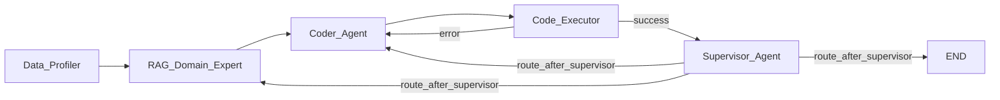

# rentals_agents

LangGraph multi-agent pipeline for rental price prediction — HSE Agents course project.

## Architecture



### Nodes

| Node | Type | Owner |
|------|------|-------|
| `Data_Profiler` | Python function | MLOps (Borya) |
| `RAG_Domain_Expert` | LLM (Llama/Mistral) | RAG engineer |
| `Coder_Agent` | LLM (Qwen2.5-Coder) | Architect (Anna) |
| `Code_Executor` | Python + subprocess | DevOps |
| `Supervisor_Agent` | LLM (Llama/Mistral) | Architect (Anna) |

### Agentic routing & guardrails

After `Code_Executor`: **deterministic** branch — error → `Coder_Agent`, success → `Supervisor_Agent`.

After `Supervisor_Agent`: LLM proposes `next_node`, then **`route_after_supervisor`** applies guardrails in priority order:

1. `iteration_count >= MAX_GRAPH_ITERATIONS` → force **END**
2. `mse <= TARGET_MSE_THRESHOLD` → force **END**
3. invalid / unparseable `next_node` → fallback to **`Coder_Agent`**
4. Otherwise, trust the Supervisor's decision

The LLM **never** has final say on stopping — Python guardrails always run last.

---

## Quick start

### 1. Install

```bash
pip install -e ".[dev]"
```

Requires Python 3.11+.

### 2. Run tests (no Ollama needed)

```bash
pytest tests/ -v
```

`MOCK_LLM=1` is the default. All tests pass without a running Ollama server.

### 2.5. Install full vector-RAG stack

```bash
pip install -e ".[dev,rag]"
```

The vector backend uses ChromaDB. By default it tries Chroma + ONNX MiniLM
(`all-MiniLM-L6-v2`) and falls back to lexical retrieval if the embedding model
is unavailable.

### 3. Run with real models

Install Ollama: https://ollama.com

```bash
ollama pull qwen2.5-coder:7b
ollama pull llama3:8b

MOCK_LLM=0 python main.py
```

---

## Configuration

All settings via environment variables (no `.env` file required):

| Variable | Default | Description |
|----------|---------|-------------|
| `MOCK_LLM` | `1` | `1` = mock mode (no Ollama); `0` = real LLM calls |
| `DATA_DIR` | `data` | Directory with train.csv / test.csv (relative to project root) |
| `TARGET_MSE` | `500.0` | Stop when MSE ≤ this value |
| `MAX_ITER` | `10` | Hard iteration cap |
| `OLLAMA_BASE_URL` | `http://localhost:11434` | Ollama server URL |
| `QWEN_CODER_MODEL` | `qwen2.5-coder:7b` | Model for Coder_Agent |
| `LLM_MODEL` | `llama3:8b` | Model for RAG + Supervisor |
| `OLLAMA_TIMEOUT` | `120.0` | Request timeout (seconds) |
| `KNOWLEDGE_BASE_DIR` | `data/knowledge_base` | Local RAG corpus (`.md`/`.txt`) |
| `RAG_TOP_K` | `3` | Number of retrieved chunks passed to RAG_Domain_Expert |
| `RAG_CHUNK_SIZE` | `900` | Chunk size for local knowledge files |
| `RAG_CHUNK_OVERLAP` | `120` | Overlap between adjacent chunks |
| `RAG_MAX_CONTEXT_CHARS` | `4000` | Prompt budget for retrieved snippets |
| `RAG_RETRIEVER_BACKEND` | `auto` | `auto`, `chroma`, or `lexical` |
| `RAG_EMBEDDING_BACKEND` | `auto` | `auto`, `onnx_mini_lm`, or `hash` |
| `RAG_EMBEDDING_CACHE_DIR` | `.cache/chroma` | Writable cache for ONNX MiniLM |
| `CHROMA_PERSIST_DIR` | `data/chroma_db` | Persistent ChromaDB directory |
| `CHROMA_COLLECTION_NAME` | `rentals_feature_ideas` | Collection name for RAG chunks |

---

## Benchmarking & Experiment Log

After each pipeline run, two files are created in the project root:

- **`report.txt`** — human-readable summary with:
  - total execution time
  - total input/output tokens (collected from all LLM calls)
  - final MSE

- **`experiment_log.json`** — structured JSON log with:
  - timestamp, duration
  - token counts
  - final MSE, iteration count, MSE history
  - supervisor reasoning
  - complete configuration snapshot (target threshold, max iterations, models, etc.)

### Example `report.txt`

```text
=== Benchmark Report ===
Total execution time: 45.23 seconds
Total input tokens: 12345
Total output tokens: 6789
Total tokens: 19134
Final MSE: 425.6
```

### Example `experiment_log.json`
```json
{
  "timestamp": 1712345678.123,
  "duration_seconds": 45.23,
  "total_input_tokens": 12345,
  "total_output_tokens": 6789,
  "final_mse": 425.6,
  "iteration_count": 3,
  "mse_history": [4230.5, 1250.3, 425.6],
  "supervisor_reasoning": "MSE improved, but still above threshold — continue with new features",
  "config": {
    "target_mse_threshold": 500.0,
    "max_iterations": 10,
    "mock_llm": false,
    "data_dir": "data",
    "ollama_base_url": "http://localhost:11434",
    "qwen_coder_model": "qwen2.5-coder:7b",
    "llm_model": "llama3:8b"
  }
}
```

These files help you compare different runs, debug performance, and reproduce results.

## Dataset

**Source:** MWS AI Agents 2026 Kaggle competition — NYC short-term rentals (Airbnb-style).

| Column | Description |
|--------|-------------|
| `name` | Listing title |
| `_id` | Unique listing ID |
| `host_name` | Host name |
| `location_cluster` | NYC borough (Manhattan, Brooklyn, Queens, Bronx, Staten Island) |
| `location` | Neighbourhood name |
| `lat`, `lon` | GPS coordinates |
| `type_house` | Entire home/apt · Private room · Shared room |
| `sum` | Listed price per night ($) |
| `min_days` | Minimum booking duration (days) |
| `amt_reviews` | Number of reviews |
| `last_dt` | Date of last review (NaN if no reviews) |
| `avg_reviews` | Average review score (NaN when amt_reviews = 0) |
| `total_host` | Number of listings by this host |
| `target` | **Target variable** (float, 0–365) |

Train: 36,671 rows. Test: 12,264 rows. Submission: `index,prediction`.

---

## Project structure

```
src/rentals_agents/
  config.py          # env-based constants
  state.py           # TypedDict State — team contract
  routing.py         # route_after_executor, route_after_supervisor (guardrails)
  llm/
    ollama_client.py # HTTP client for Ollama
    json_utils.py    # parse LLM JSON responses
  rag/
    knowledge_base.py # load and chunk local source documents
    retriever.py      # lexical retriever for top-k chunks
    vector_store.py   # ChromaDB vector retriever + embedding backends
    evaluation.py     # prompt-quality and feature-plan adequacy checks
    service.py        # prompt-ready retrieval API for rag_node
  prompts/
    system.py        # system prompts for RAG, Coder, Supervisor
  graph/
    nodes.py         # node functions (mock + real stubs)
    builder.py       # StateGraph wiring
tests/
  test_routing.py    # guardrail unit tests (16 cases)
  test_graph_smoke.py  # end-to-end mock graph run
```

## For teammates

### Implementing your module

All nodes share the same contract: accept `state: State`, return `dict` with updated keys only.

**DevOps (Code_Executor):** replace `executor_node` in `graph/nodes.py`. Your function must set:
```python
return {
    "execution_result": "<stdout+stderr>",
    "execution_ok": True | False,
    "metrics": {"mse": <float>},
    "mse_history": [<float>],       # append ONE value; reducer accumulates
    "iteration_count": state["iteration_count"] + 1,
}
```

**RAG engineer (RAG_Domain_Expert):** replace `rag_node`. Your function must set:
```python
return {"features_plan": ["idea 1", "idea 2", ...]}
```

**MLOps/Borya SuperStar (Data_Profiler + metrics):**
- Replace `data_profiler_node` — set `{"df_info": "<text summary>"}`. DONE!!
- After your CV code runs, write MSE to `metrics` and append to `mse_history` in `executor_node`. DONE!!
The repository now includes a local RAG corpus in `data/knowledge_base/` plus a
retrieval layer in `src/rentals_agents/rag/`. The current implementation is
hybrid and CI-friendly:
- Primary path: ChromaDB vector retrieval with ONNX MiniLM (`all-MiniLM-L6-v2`)
- Offline/test path: lexical fallback or hash embeddings

The knowledge base now also carries explicit source provenance in
`data/knowledge_base/sources.json`, so each retrieved chunk can be traced back
to its external material.

### RAG prompt evaluation

To test how the real reasoning model reacts to retrieved context:

```bash
MOCK_LLM=0 python -m rentals_agents.rag.prompt_eval
```

This runs a small regression suite of dataset summaries, feeds retrieved
context into the RAG prompt, and checks whether the returned feature plan covers
the main signal families we expect: location, time, price, reviews, and host behavior.

**MLOps/Borya (Data_Profiler + metrics):**
- Replace `data_profiler_node` — set `{"df_info": "<text summary>"}`.
- After your CV code runs, write MSE to `metrics` and append to `mse_history` in `executor_node`.
- `target_threshold` comes from `config.TARGET_MSE_THRESHOLD`; pass it to Supervisor prompt via `supervisor_system_prompt()`.

### State fields reference

See `src/rentals_agents/state.py` for the full TypedDict with field-level docstrings.

Key note: **`mse_history` uses a LangGraph reducer** (`operator.add`). Always return `{"mse_history": [new_value]}` — never the full list — or you will get double-appending.
