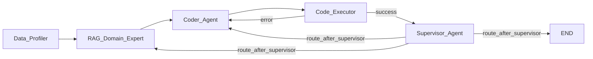

# rentals_agents

LangGraph multi-agent pipeline for rental availability / downtime prediction — HSE Agents course project.

## Architecture



### Nodes

| Node | Type | Owner |
|------|------|-------|
| `Data_Profiler` | Python function | MLOps (Борис) |
| `RAG_Domain_Expert` | LLM (Qwen 72B) | RAG engineer (Тимофей) |
| `Coder_Agent` | LLM (Qwen2.5‑Coder 7B) | Architect (Анна) |
| `Code_Executor` | Python + subprocess | DevOps (Андрей) |
| `Supervisor_Agent` | LLM (Qwen 72B) | Architect (Анна) |

### Routing & guardrails (Python‑enforced)

After `Code_Executor`: **deterministic** 
- execution_ok = True → `Supervisor_Agent`

- execution_ok = False and consecutive_errors < 3 → `Coder_Agent`

- consecutive_errors >= 3 → `Supervisor_Agent` (let Supervisor propose fallback).

- After `Supervisor_Agent`: LLM proposes `next_node`, then **`route_after_supervisor`** applies guardrails in priority order:

1. `iteration_count >= MAX_GRAPH_ITERATIONS` → force **END**
2. `mse <= TARGET_MSE_THRESHOLD` → force **END**
3. invalid / unparseable `next_node` → fallback to **`Coder_Agent`**
4. Otherwise, trust the Supervisor's decision

The LLM **never** has final say on stopping — Python guardrails always run last.

---

## Quick start

### 1. Install

```bash
pip install -e ".[dev]"          # core + test dependencies
pip install -e ".[dev,rag]"      # + ChromaDB / ONNX for vector RAG
```

Requires Python 3.11+.

### 2. Run tests (no Ollama needed)

```bash
pytest tests/ -v
```

`MOCK_LLM=1` is the default. All tests pass without a running Ollama server.

### 3. Run with real models

Install Ollama: https://ollama.com

```bash
ollama pull qwen2.5-coder:7b
ollama pull qwen2.5:72b
```
Then
```bash
MOCK_LLM=0 python main.py
```
Make sure `data/train.csv` and `data/test.csv` exist (see Dataset).
---

## Configuration

All settings via environment variables (no `.env` file required):

| Variable | Default | Description |
|----------|---------|-------------|
| `MOCK_LLM` | `1` | `1` = mock mode (no Ollama); `0` = real LLM calls |
| `DATA_DIR` | `data` | Directory with `train.csv` / `test.csv` (relative to project root) |
| `TARGET_MSE` | `9200.0` | Stop when MSE ≤ this value |
| `MAX_ITER` | `10` | Hard iteration cap |
| `OLLAMA_BASE_URL` | `http://localhost:11434` | Ollama server URL |
| `QWEN_CODER_MODEL` | `qwen2.5-coder:7b` | Model for `Coder_Agent` |
| `LLM_MODEL` | `qwen2.5:72b` | Model for `RAG_Domain_Expert` + `Supervisor_Agent` |
| `OLLAMA_TIMEOUT` | `300.0` | Request timeout (seconds) |
| `KNOWLEDGE_BASE_DIR` | `data/knowledge_base` | Local RAG corpus (`.md`/`.txt`) |
| `RAG_TOP_K` | `3` | Number of retrieved chunks passed to RAG_Domain_Expert |
| `RAG_CHUNK_SIZE` | `900` | Chunk size for local knowledge files |
| `RAG_CHUNK_OVERLAP` | `120` | Overlap between adjacent chunks |
| `RAG_MAX_CONTEXT_CHARS` | `4000` | Prompt budget for retrieved snippets |
| `RAG_RETRIEVER_BACKEND` | `auto` | `auto`, `chroma`, or `lexical` |
| `RAG_EMBEDDING_BACKEND` | `auto` | `auto`, `onnx_mini_lm`, or `hash` |
| `RAG_EMBEDDING_CACHE_DIR` | `.cache/chroma` | Writable cache for ONNX MiniLM |
| `CHROMA_PERSIST_DIR` | `data/chroma_db` | Persistent ChromaDB directory |
| `CHROMA_COLLECTION_NAME` | `rentals_feature_ideas` | Collection name for RAG chunks |

---

## Benchmarking

After each pipeline run, the Benchmark singleton collects:

- Total execution time

- Total input / output tokens (from all LLM calls)

- Final MSE

To print a report:

```bash
from rentals_agents.benchmark import Benchmark
print(Benchmark().report())
```

### Example output:

```text
=== Benchmark Report ===
Total execution time: 45.23 seconds
Total input tokens: 12345
Total output tokens: 6789
Total tokens: 19134
Final MSE: 425.6
```

Note: Automatic writing to `report.txt` / `experiment_log.json` is not implemented in this version – you can extend Benchmark or call it from your own script.

## Dataset

**Source:** MWS AI Agents 2026 Kaggle competition — NYC short-term rentals (Airbnb-style).

| Column | Description |
|--------|-------------|
| `name` | Listing title |
| `_id` | Unique listing ID |
| `host_name` | Host name |
| `location_cluster` | NYC borough (Manhattan, Brooklyn, Queens, Bronx, Staten Island) |
| `location` | Neighbourhood name |
| `lat`, `lon` | GPS coordinates |
| `type_house` | Entire home/apt · Private room · Shared room |
| `sum` | Listed price per night ($) |
| `min_days` | Minimum booking duration (days) |
| `amt_reviews` | Number of reviews |
| `last_dt` | Date of last review (NaN if no reviews) |
| `avg_reviews` | Average review score (NaN when amt_reviews = 0) |
| `total_host` | Number of listings by this host |
| `target` | **Target variable** (float, 0–365) |

Train: 36,671 rows. Test: 12,264 rows. Submission: `index,prediction`(CSV).

---

## Project structure

```
src/rentals_agents/
  config.py          # env‑based constants
  state.py           # TypedDict State – team contract
  routing.py         # route_after_executor, route_after_supervisor (guardrails)
  llm/
    ollama_client.py # HTTP client for Ollama
    json_utils.py    # parse JSON from LLM responses
  rag/
    knowledge_base.py # load and chunk source documents
    retriever.py      # lexical retriever for top‑k chunks
    vector_store.py   # ChromaDB vector retriever + embedding backends
    evaluation.py     # prompt‑quality and feature‑plan adequacy checks
    service.py        # prompt‑ready retrieval API for rag_node
  prompts/
    system.py        # system prompts for RAG, Coder, Supervisor
  graph/
    nodes.py         # node functions (mock + real implementations)
    builder.py       # StateGraph wiring
  benchmark.py       # singleton for token & timing metrics
tests/
  test_routing.py    # guardrail unit tests (16 cases)
  test_graph_smoke.py  # end‑to‑end mock graph run
```

## Development notes

### Implementing a node

All nodes accept `state: State` and return a `dict` with only the keys they update.
See `state.py` for the exact field contracts.

- `data_profiler_node` → `{"df_info": str}`

- `rag_node` → `{"features_plan": list[str]}`

- `coder_node` → `{"generated_code": str}`

- `executor_node` → must set `execution_result`, `execution_ok`, `metrics`, `mse_history` (append one value), `iteration_count`, `consecutive_errors`

- `supervisor_node` → `{"next_node": str, "supervisor_reasoning": str}`

### Adding new features
1. Update `State` TypedDict if new fields are needed.

2. Add corresponding keys in the returning dict of your node.

3. Extend routing logic in routing.py if necessary.

## Troubleshooting

| Problem | Likely cause | Solution |
|------|------|-------|
| `OllamaError: Cannot reach Ollama` | Ollama not running or wrong `OLLAMA_BASE_URL` | Run `ollama serve`, check URL |
| `JSON parse error` in LLM response | Model did not follow output schema | Check system prompt; increase `temperature` |
| `pd.get_dummies() is banned` | Coder used one‑hot encoding | The executor rejects it – instruct model to use CatBoost native categoricals |
| `submission.csv validation error` | Wrong column names or non‑finite predictions | Coder must write `index,prediction` with numeric values |
| `ChromaDB fails in CI` | ONNX model download or cache permission | Set `RAG_RETRIEVER_BACKEND=lexical` or use `MOCK_LLM=1` |