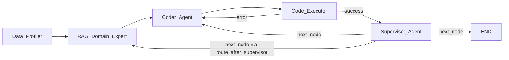

Upd: пишите что нравится не нравится!:) У всех есть права на редактирование.

### **1. Проектирование Графа (Архитектура)**

Состояние (State) должно содержать:

* `df_info` (строка: типы колонок, пропуски — генерируется кодом, не LLM)  
* `features_plan` (список идей от RAG-агента)  
* `generated_code` (Python-код от агента-кодера)  
* `execution_result` (строка: логи консоли или текст ошибки Traceback)  
* `metrics` (словарь: MSE, время, токены)  
* `iteration_count` (счетчик циклов, чтобы не уйти в бесконечность)  
* `next_node` (строка, например Literal): куда идти после Supervisor — `RAG_Domain_Expert` | `Coder_Agent` | `END` (после применения guardrails).  
* `mse_history` (список чисел): последние MSE по успешным итерациям — чтобы Supervisor видел динамику и «стагнацию» (CoT в промпте).  
* `supervisor_reasoning` (строка, опционально): копия поля `reasoning` из JSON Supervisor для логов, `experiment_log` и README.

**Порог качества:** `target_threshold` — **максимально допустимый MSE** (чем ниже MSE, тем лучше). Остановка по качеству: при `mse <= target_threshold`. Значение хранить в конфиге и передавать в промпт Supervisor как «целевое качество»; жёсткое завершение по порогу и лимиту итераций — в **guardrails** (см. ниже).

#### Nodes and Conditional Edges

1. **Node `Data_Profiler` (Python-функция).** Загружает датасет, делает df.info(), df.head(), считает базовую статистику таргета (mean, min, max, распределение дней, наличие выбросов) и записывает текст в State. *Зачем: экономит время и контекст, исключает галлюцинации на старте.*  
2. **Node `RAG_Domain_Expert` (LLM).** Читает `df_info`, делает запрос в векторную базу (статьи про аренду, Kaggle-трюки), генерирует `features_plan`.  
3. **Node `Coder_Agent` (LLM — Qwen).** Берет `features_plan` и пишет код: предобработка + обучение CatBoost/LightGBM + сохранение submission.csv. Фактически выдаёт JSON с полем `code`.  
   **Контракт вывода (JSON):** Промпт жестко требует от Qwen возвращать только валидный JSON без маркдаун-обёрток (без fenced block вида triple-backtick + json). Ожидаемая схема: `{"explanation": "Краткое описание того, что делает код", "code": "чистый python-код для запуска"}`.  
4. **Node `Code_Executor` / Validator (Python-функция + Песочница).** Запускает код из State в изолированной среде. Перехватывает ошибки. *Дополнительно (Data Validation):* жестким кодом проверяет адекватность финального датафрейма (например, что в `submission.csv` нет NaN и значения таргета являются числами, не содержат NaN (согласно `sample_submission.csv`)). Если есть аномалии — возвращает ошибку в `State`. Логи `stdout`/`stderr` остаются в `execution_result` и доступны следующим узлам (в т.ч. Supervisor).  
5. **Node `Supervisor_Agent` (LLM; в коде графа можно оставить алиас `Critic_Agent`).** Агентный маршрутизатор после успешного прогона. Получает: кратко `df_info`, `execution_result`, текущий и предыдущий MSE / `mse_history`, `iteration_count`, кратко `features_plan`, при необходимости — контекст из RAG; в промпте также `target_threshold` как целевое качество.  
   **Выход:** строгий JSON, например: `{"reasoning": "...", "next_node": "RAG_Domain_Expert" | "Coder_Agent" | "END"}`.  
   **Роль Python после ответа LLM:** распарсить JSON, записать `reasoning` в `supervisor_reasoning` и **не подменять** решение модели до слоя **guardrails** — см. ветвление 2.

**Условия ветвления:**

* **Ветвление 1 (после `Code_Executor`) — детерминированное («безопасное», без LLM):**  
  * *If error in `execution_result`:* в узел **`Coder_Agent`** (передаём ошибку для исправления).  
  * *If success:* в узел **`Supervisor_Agent`**.  

* **Ветвление 2 (после `Supervisor_Agent`) — agentic routing + guardrails:**  
  * Базовый маршрут: взять `next_node` из ответа LLM после парсинга JSON.  
  * Реализовать одну функцию уровня `route_after_supervisor(state) -> Literal["RAG_Domain_Expert", "Coder_Agent", "END"]`, где собраны **guardrails**:  
    * если `iteration_count >= N` (макс. итераций) → принудительно **END**;  
    * если `mse <= target_threshold` (качество достаточно) → разрешить только **END** (чтобы LLM не уводил в лишние итерации);  
    * если `next_node` не из белого списка или JSON невалиден → fallback, например **`Coder_Agent`** или повторный вызов Supervisor с сообщением об ошибке парсинга (на выбор команды).  
  * Дальше LangGraph ведёт к **`RAG_Domain_Expert`**, **`Coder_Agent`** или **END** согласно результату `route_after_supervisor`.

*Подпись:* итоговый `next_node` после узла Supervisor всегда проходит через **guardrails в Python** (`route_after_supervisor`), не «голый» вывод LLM.

### **2. Распределение задач (4 человека) = 4 параллельных стрима**

Каждый делает свой модуль, в конце собираете всё в LangGraph.

#### 

#### **Участник 1: Архитектор [Anna Lazareva](mailto:annelzrv@gmail.com) (Отвечает за "Архитектура и взаимодействие" — 20%)**

**Задача:** Написать сам скелет LangGraph и подключить Open Source модели (настроить локальный сервер через Ollama или использовать инференс-провайдеров).

**План:**

* Написать классы State (включая `next_node`, `mse_history`, `supervisor_reasoning`).  
* Описать базовые графы и ветвления: после Executor — детерминированно; после Supervisor — `route_after_supervisor` с guardrails.  
* Настроить системные промпты (System Prompts) для каждого агента, чтобы они отдавали ответы в строгом JSON-формате; отдельно — **промпт Supervisor** + JSON schema (`reasoning`, `next_node`).  
* Реализовать **функцию маршрутизации с guardrails** (`route_after_supervisor`).

**Почему:** Без жесткого графа Open Source модели начнут болтать лишнее, писать текст вместо кода и ломать пайплайн. Agentic flow при этом остаётся управляемым за счёт guardrails.

#### **Участник 2: RAG-Инженер @? (Отвечает за "Качество и гибкость модели" — 20%)**

**Задача:** Создать базу знаний и агента-генератора идей.

**План:**

* Поднять локальную векторную БД (ChromaDB — самый простой вариант).  
* Загрузить туда 3-4 pdf/txt файла: базовые методы обработки временных рядов (ведь у нас аренда по дням), работа с непрерывным таргетом, обработка выбросов, мануал по CatBoost, статьи про ценообразование в недвижимости.  
* Написать функцию, которая по запросу отдает релевантные куски текста агенту-эксперту.

**Почему:** МТС требует RAG-модуль. Без него снизят балл. Плюс, именно RAG подскажет кодеру сгенерировать правильные фичи (типа "день недели", "праздник", "расстояние до метро"), что поднимет метрику в Kaggle.

*Опционально позже:* учесть, что `features_plan` при возврате из цикла может дополняться — при необходимости отдельное поле в State.

#### 

#### **Участник 3: DevOps / Security @? (Отвечает за "Автоматизация и безопасность" — 20%)**

**Задача:** Реализовать узел `Code_Executor`.

**План:**

* Код, сгенерированный LLM, нельзя запускать через exec() напрямую в основной системе — это провал по безопасности.  
* Нужно написать Python-обертку, которая сохраняет код агента в файл `temp_script.py` и запускает его через subprocess.run() с тайм-аутом (чтобы зависший цикл не убил систему) и ограниченными правами. Идеально — внутри Docker-контейнера.  
* Написать парсер логов, который ловит stderr (текст ошибки) и аккуратно передает его обратно в LangGraph; **stdout/stderr** доступны в `execution_result` для Supervisor.

**Почему:** Критерий "Безопасность (guardrails, мониторинг)". Если преподаватель увидит eval() или exec() без изоляции, он срежет баллы. Выполнение через subprocess с лимитами покажет инженерную зрелость.

#### **Участник 4: Метрики и Git @Боря (Отвечает за "Benchmarking" и "Документированность" — 40%)**

**Задача:** Инфраструктура оценки и упаковка проекта.

**План:**

* **Метрики для Supervisor:** вычисление MSE на кросс-валидации (Time Series Split, так как данные аренды имеют временную структуру!). Запись текущего MSE в `metrics`, **append в `mse_history`** после каждой успешной валидной итерации (как договоритесь в коде). Логика «достаточно ли хорошо» для остановки — не отдельный if вместо LLM, а **порог в конфиге + guardrails** и подача порога в промпт Supervisor.  
* **Бенчмаркинг:** Написать декораторы или callback-функции, которые считают: сколько времени работал граф, сколько токенов (слов) сгенерировали модели, итоговый MSE. Выводить это в красивый report.txt.  
* Оформить репозиторий: написать README.md с картинкой графа (LangGraph умеет рисовать свои графы через `graph.get_graph().draw_mermaid()`), инструкцией по запуску (типа docker-compose up или python main.py). В README кратко описать **agentic routing (Supervisor) и guardrails** для защиты проекта.

**Почему:** Это самые "бесплатные" 40% оценки. Преподаватели любят красивые README и четкие таблицы с метриками (LLM Benchmarking — прямое требование).

### 

### **Карта зависимостей (Кто кого блокирует)**

* **Архитектор (Анна)** блокирует всех в самом начале. Пока не опишем схему `State` (какие ключи есть в словаре состояния), остальные не смогут правильно написать `return` в своих функциях.  
* **DevOps (?)** блокирует интеграционное тестирование. Пока нет безопасной песочницы для запуска кода, Архитектор не может прогнать граф от начала до конца (иначе сгенерированный код сломает локальную среду).  
* **MLOps (Боря)** блокирует **`Supervisor_Agent`**. Пока нет корректного **MSE на кросс-валидации** и **`mse_history`**, Supervisor не на что опираться для осмысленного CoT и маршрутизации.  
* **RAG-Инженер (?)** никого жестко не блокирует до самого финала. Граф может работать с "заглушкой" вместо RAG (например, выдавать хардкод-строку "добавь лаговые фичи"). RAG нужен для итогового качества модели (Kaggle), поэтому ? может спокойно пилить базу знаний параллельно со всеми.

### Footnotes

P.S. Для кодинга лучше всего подойдет Qwen2.5-Coder-7B (или 32B, если есть GPU), а для RAG и рефлексии — Llama-3-8B или Mistral-Nemo. Их удобнее всего поднимать через **Ollama** или **vLLM**.
